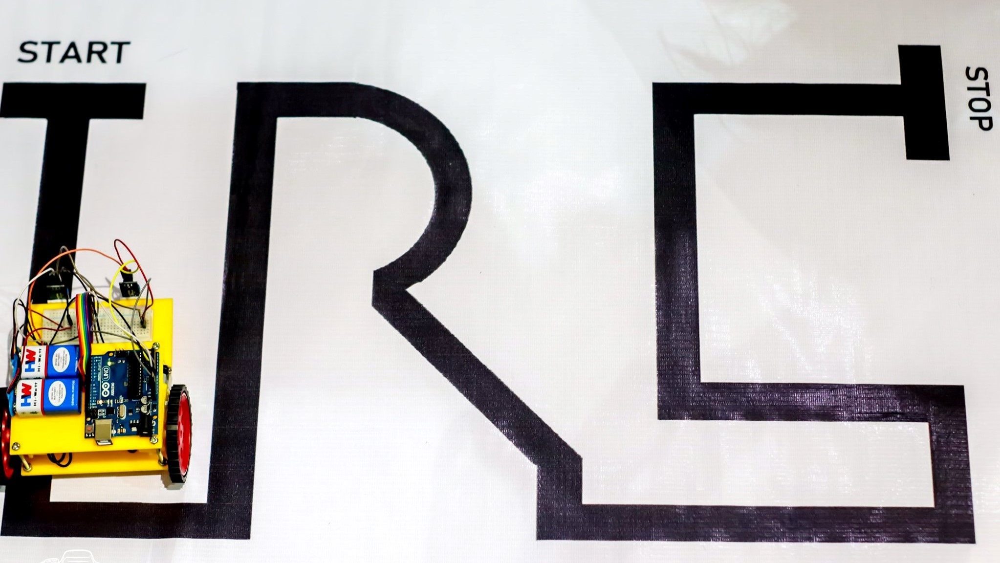
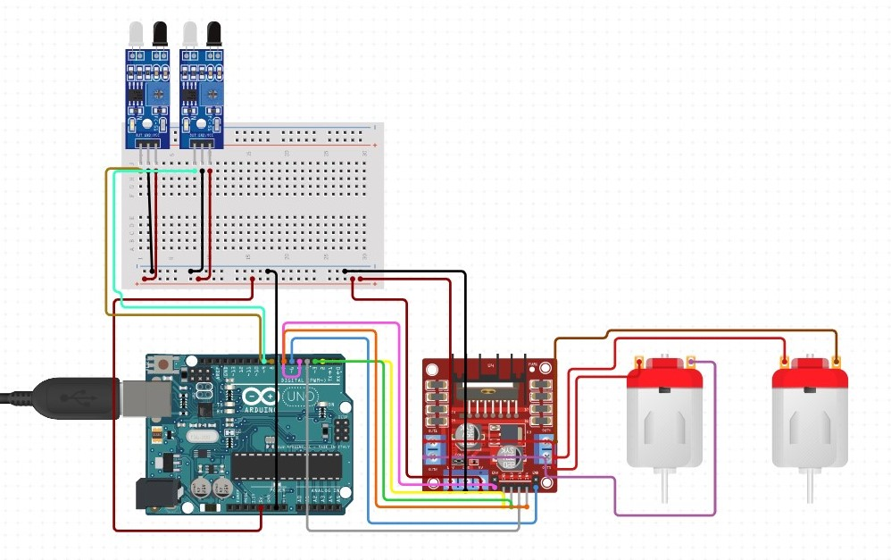
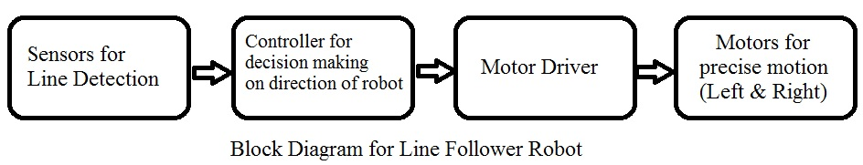

# Line Follower Autonomous Robot

## What is a *Line Follower Robot?*
A Line Follower Robot, is an automated guided vehicle, which follow a visual line embedded on the floor or ceiling. Usually, the visual line is the path in which the line follower robot goes and it will be a black line on a white surface but the other way (white line on a black surface) is also possible.

Line follower Robot is one of the first robots that beginners and students would get their first robotic experience with. In this project, we have designed a simple Line Follower Robot using Arduino and some other components.

## Components Required
- Arduino UNO 
- L293D Motor Driver IC 
- BO Geared Motors x 2 
- Robot Chassis 
- IR Sensor Module x 2
- Black Tape (Electrical Insulation Tape)
- Jumper Wires or Connecting Wires
- Power supply 

## Circuit Diagram

## Block Diagram
This block diagram will give you an idea about how the line follower works.

## Working of the Bot

The working of a line follower robot is pretty straight forward. These robots have the capability to detect a black/dark line on a lighter surface depending on the contrast. They estimate whether the line underneath them is shifting towards their left/right as they move over them. Based on that estimation they give respective signals to the motors to turn left/right so as to maintain a steady center with respect to the line.

## Code

This is a very basic code for the Line Follower Robot with 2 IR sensors. (<a href="https://github.com/ITER-ROBOTICS-CLUB/LineFollower/tree/master/code#exactline">Click Here</a>)

But you can develop more stronger code for different arrays and share with us.

# Thank you! 
## < > KEEP ROBOTIZING < / >
